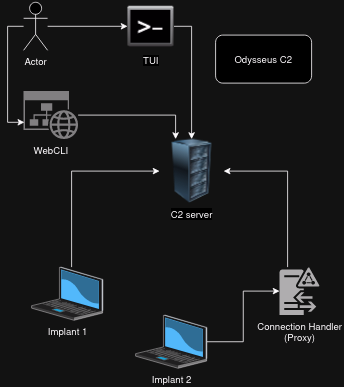

# Odysseus C2 framework
C2 framework that makes use of object loading and has different handlers, clients and implants. This project is for fun and learning purposes, it can be used in red team operations.

## Server
The C2 server that stands in the center of this project.

## Clients
The interface which the owner uses to connect with the C2 server.

## Implants
The implant programs that connects to the C2 server and is been runned by the victims.

## Handlers
Handles different types of connections and bounces the requests to the C2 server.

## Framework architecture

## Class diagram

